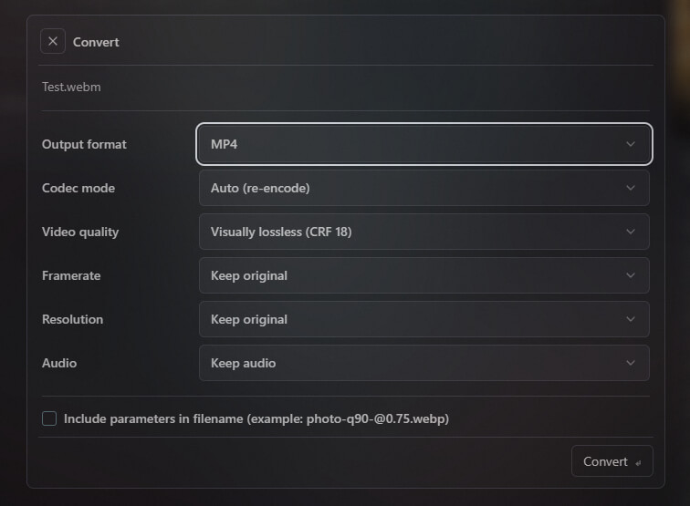

# Media Converter - Sigma File Manager Extension

Convert videos and images to other formats, reduce image size in one click, and more.

## Features

#### Optimization
- **Reduce size** - reduce image size in one click by removing visually imperceivable details. Optimized images look almost Indistinguishable from the originals.

#### Coversion
- Convert videos between formats (MP4, MKV, WebM, AVI, MOV)
- Convert videos to GIFs with optional palette optimization
- Convert images between formats (PNG, JPG, WebP, AVIF, BMP, TIFF)
- Change video framerate and resolution (when re-encoding)
- Re-encode videos with configurable quality (CRF)
- Stream-copy mode for fast remuxing without re-encoding
- Remove audio from videos or copy the audio stream unchanged
- Batch convert multiple files at once. Extension intelligently separates images and videos in mixed selections (each group gets its own options)
- Optional suffix in output filenames that encodes chosen parameters
- Progress tracking with cancellation support
- Cross-platform: Windows, macOS, Linux

## Usage

### Convert

**Context menu**

1. Select one or more media files in the file browser
2. Right-click and choose **Convert** from the context menu
3. Configure conversion options in the modal dialog
4. Click **Convert** to start

**Command palette**

1. Open the command palette
2. Run **Convert selected media files**
3. The extension uses the current selection if none was passed

### Reduce size

**Context menu**

1. Select one or more supported image or video files
2. Right-click and choose **Reduce size**

**Command palette**

1. Run **Reduce size of selected media files**

There is no options dialog: output is written next to the original as `basename - reduced` with the same or a normalized extension (for example WMV/FLV/3GP become MP4; BMP/TIFF often become PNG). If a reduced file is still not smaller than the source, you may get a hint notification.

### Video options (non-GIF)

| Option | Choices |
|--------|---------|
| Output format | MP4, MKV, WebM, AVI, MOV, GIF |
| Codec mode | Auto (re-encode), Copy (fast, no quality loss) |
| Video quality | Visually lossless (CRF 18), High (CRF 23), Mid (CRF 28), Low (CRF 35) - only when codec mode is Auto |
| Framerate | Keep original, 60 / 30 / 24 / 15 / 10 fps - only when codec mode is Auto |
| Resolution | Keep original, 1080p, 720p, 480p, 360p - only when codec mode is Auto |
| Audio | Keep audio, Remove audio, Copy audio stream |

### GIF options (when output format is GIF)

| Option | Choices |
|--------|---------|
| Framerate | Keep original (output defaults to 15 fps when kept), or 60 / 30 / 24 / 15 / 10 fps |
| Width | Keep original, 640px, 480px, 320px, 240px |
| High quality GIF palette | On (default): two-pass palette; off: faster single-pass scaling |

Codec mode, CRF quality, and resolution controls are not shown for GIF; GIF uses its own filter path.

### Image options

| Option | Choices |
|--------|---------|
| Output format | PNG, JPG, WebP, AVIF, BMP, TIFF |
| Quality | Highest (100), High (90), Medium (75), Low (50) |
| Resize | Keep original, 75%, 50%, 25%, 1920px / 1280px / 800px wide |

### Other

| Option | Meaning |
|--------|---------|
| Include parameters in filename | When enabled, appends a short suffix derived from settings (for example `-crf18`, `-15fps`, `-q90-@0.75`) before the extension so outputs stay distinguishable |

## Supported formats

### Video input

mp4, mkv, webm, avi, mov, wmv, flv, ts, mts, m4v, 3gp

### Image input

png, jpg, jpeg, webp, bmp, tiff, tif, avif, gif
